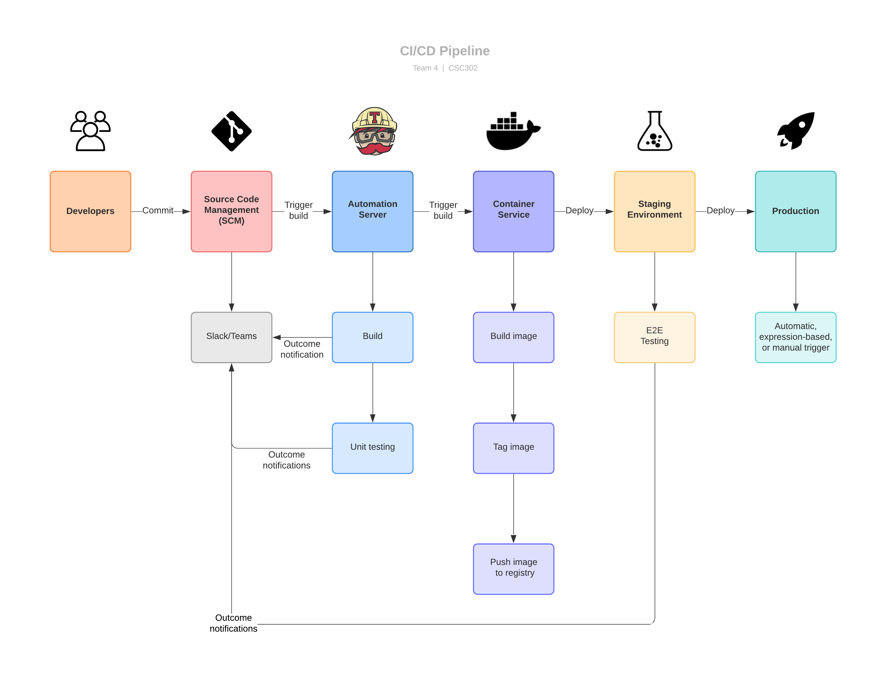

# Architecture

# Frontend
Frontend will use React as UI framework. In addition, we will utilize Redux for global state management in the frontend and Material-UI to give the app a Material Design look.

# Database
For our project, we are using MongoDB which follows the NoSQL database architecture. Data representation is in form of nested JSON objects. Each SDCForm type will be represented by a unique schema depending on the structure of the data it contains. Our choice of database was informed by the technologies we are using. We realized that mongoDB's JSON objects would be easier to parse and process in node and express compared to SQL scripts or any other data format, hence the choice of the database.

# Continuous Integration
The CI Architecture is built upon Travis and will follow these steps for every build.
Build the code -> Run test scripts -> Deploy to server (on commits to deployment branch)
Each step will run only if the previous step is complete.

