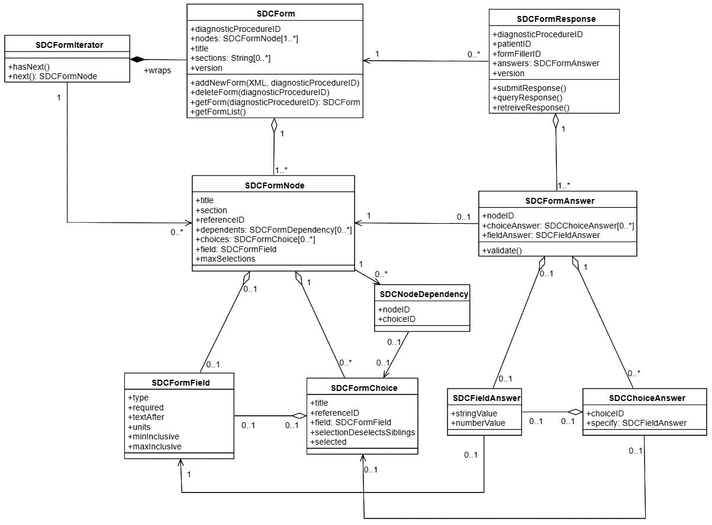

# Model

## UML

Our model is approximately a 1-1 translation of our UML viewable in large format at UML.pdf. There are a few notable additions to the model requirements of the handout we determined during planning and analyzing the original XML forms.

### Form versioning
The SDCForm refers to a specific version of a form for a given diagnosticProcedureID form. Once submitted to the system it gets a version remains in the system forever to associate with any already completed SDCFormResponses. If a new form is added, we simply add it and increment the version number.

### Dependency representation
The SDCNodeDependency maintains a reference to the selection required to fulfill the dependency, which we found in parsing the form was always as a choice answer. This allows the front end to create control structures to enable/disable this branch of questions whether the answer is satisfied.

### Fields and choices
Each SDCFormNode either has an SDCFormField value OR a list of SDCFormChoices. The SDCFormChoices themselves may contain an SDCFormField (e.g. when selecting "other - please specify"). When adding these models we discovered the original forms had numerous optional fields that could exist, for example whether a choice in a multiple choice question would deselect the other option. Our field and choice models reflect these optional fields.

The SDCAnswer can have either an SDCFieldAnswer, or list of SDCChoiceAnswers, based on the question parameters and we can note the SDCChoiceAnswers can also contain an SDCFieldAnswer to reflect multiple choice options that require a text specification.

## Symmetry
You may notice that our model is symmetrical, i.e. SDCForm->SDCFormResponse, SDCFormNode->SDCFormAnswer, SDCFormField->SDCFieldAnswer, SDCFormChoice->SDCChoiceAnswer. It was structured this way for us to cleanly separate the forms and questions as they are defined and their fulfilled state. When combined with the data of the original SDCForm, an SDCFormResponse can then be used to render a persistent form response by pairing up each SDCFormNode in the SDCForm with its SDCFormAnswer in the SDCFormResponse. This creates an efficient database model that does not store redundant information.
